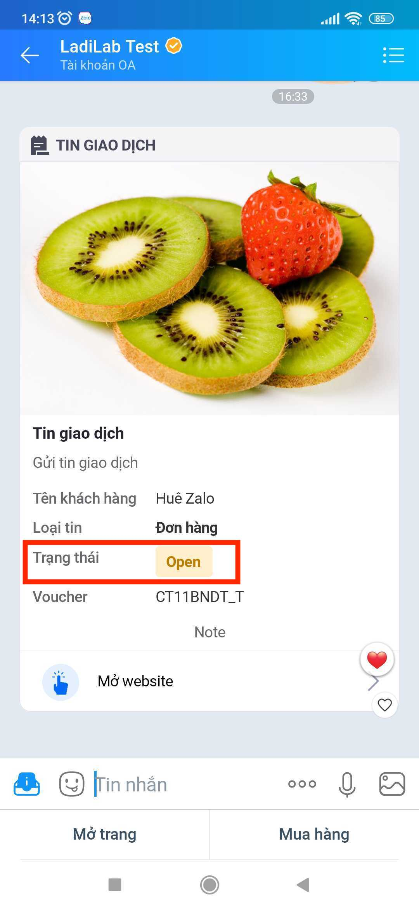

# Zalo Quan Tâm

Zalo quan tâm là dịch vụ gửi tin nhắn cho những khách hàng tương tác với Zalo OA của bạn.

1. **Chọn loại tin nhắn gửi đi:**

* **Tin tư vấn**

Chỉ gửi được tin tư vấn nếu khách hàng có tương tác với OA trong vòng **7 ngày**.

Chỉ gửi được tin nhắn văn bản, hình ảnh, file đính kèm.


Thời gian gửi tin Tư vấn 24/24


* **Tin giao dịch: thông báo cho khách hàng về giao dịch**

Chỉ gửi được tin giao dịch nếu khách hàng có tương tác với OA trong vòng **1 năm**.

Zalo sẽ dựa vào tỉ lệ báo xấu của User với OA để đánh giá và có các hình thức xử lý đối với các trường hợp OA dùng tin Giao dịch sai mục đích, làm phiền người dùng, ...

Mẫu tin theo quy định của Zalo.


Thời gian gửi tin Giao dịch 24/24


* **Tin truyền thông**

Gửi được với tất cả các khách hàng đang quan tâm Zalo OA của bạn.

Số lượng tin truyền thông 1 khách hàng nhận trong 1 tháng áp dụng theo gói dịch vụ OA của bạn.

Số lượng tin truyền thông **1 khách hàng nhận trong 1 ngày là 1 tin.**

3. **Điền nội dung tin nhắn** theo loại tin nhắn gửi đi.
4. **Thêm hành động bổ sung**: khi gửi tin thành công, khi gửi tin thất bại.
5. Điền các thông tin cho các hành động bạn thêm ở bước 4 nếu có.
6. **Chọn tài khoản cấu hình Zalo**.


Thời gian gửi tin tư vấn từ 6h00 -> 21h59


### Tạo tin tư vấn

Một tin tư vấn chỉ được chứa văn bản hoặc hình ảnh hoặc file.

1. **Tin nhắn văn bản**

Với các tin văn bản, bạn có thể thêm nút với các hành động khác nhau.

2. **Tin nhắn hình ảnh**

Với tin nhắn hình ảnh, bạn chỉ có thể upload ảnh **tối đa 1MB**, chấp nhận loại file **.png, .jpg,** .**jpeg, .gif, .svg.** Bạn cũng có thể nhập đường dẫn của ảnh tại đây.

<figure><figcaption></figcaption></figure>

3. **Tin nhắn File**

Bạn chọn file và tải lên, hệ thống chỉ cho phép tải file **PDF, DOC và DOCX** dung lượng tối đa **5MB**.

### Tạo tin giao dịch

1. Tải ảnh lên hoặc chèn URL: **Tối đa 1MB**, chấp nhận loại file **.png, .jpg,** .**jpeg, .gif, .svg**
2. Nhập tiêu đề tin nhắn: nhập \{{ để chọn các trường tuỳ chỉnh theo khách hàng.
3. Nhập mô tả: nhập \{{ để chọn các trường tuỳ chỉnh theo khách hàng.
4.  Điền thông tin giao dịch:

    *   Thông tin khách hàng\
        Nếu bạn  chọn Tên khách hàng, bạn hãy chọn trường thông tin lưu tên khách hàng của bạn\
        Nếu bạn chọn Mã khách hàng, bạn được tuỳ chỉnh thông tin hiển thị trên tin nhắn. Ví dụ bạn muốn hiển thị Mã đơn hàng và hiển thị thông tin mã đơn hàng bạn nhập như sau:

        <figure><figcaption></figcaption></figure>
    * Loại tin nhắn: bạn chọn loại tin nhắn mà Zalo cung cấp tuỳ theo mục đích sử dụng.
    * Tin nhắn có trạng thái: nếu bạn muốn hiển thị thông tin trạng thái trong tin nhắn của bạn. Ví dụ như hình sau:

    <figure><figcaption></figcaption></figure>

    * Các trường thông tin khác: Bạn có thể thêm các thông tin khác muốn hiển thị trên tin nhắn.
5. Nhập mô tả: nhập \{{ để chọn các trường tuỳ chỉnh theo khách hàng.
6. Thêm nút CTA nếu có.

### Tạo tin truyền thông

1. Tải ảnh lên hoặc chèn URL: **Tối đa 1MB**, chấp nhận loại file **.png, .jpg,** .**jpeg, .gif, .svg**
2. Nhập tiêu đề tin nhắn:nhập \{{ để chọn các trường tuỳ chỉnh theo khách hàng.
3. Nhập mô tả: nhập \{{ để chọn các trường tuỳ chỉnh theo khách hàng.
4. Nhập thông tin truyền thông nếu muốn hiển thị các thông tin liên quan đến khách hàng
5. Nhập mô tả hiển thị phía dưới tin nhắn.
6. Thêm nút CTA nếu có, và chọn hành động tương ứng.
