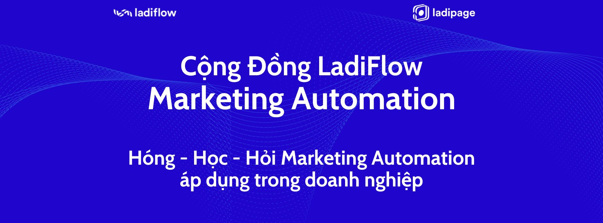

# Cộng đồng LadiFlow - Marketing Automation

Link tham gia [**Cộng đồng LadiFlow**](https://www.facebook.com/groups/475258505150725/): 👉 [**https://www.facebook.com/groups/475258505150725/**](https://www.facebook.com/groups/475258505150725/)

🤝 Đây là nơi dành riêng cho các chuyên gia, doanh nghiệp và người dùng LadiFlow cùng kết nối, chia sẻ kinh nghiệm và học hỏi về LadiFlow và Marketing Automation.&#x20;

<figure><figcaption></figcaption></figure>

Tại đây, bạn sẽ nhận được những giá trị và lợi ích như:&#x20;

📝 [**Chia sẻ từ đội ngũ LadiFlow tâm huyết:** ](#user-content-fn-1)[^1]

* Bài viết chuyên sâu về Marketing Automation&#x20;
* Template Email Marketing, Landing Page miễn phí&#x20;
* Chính sách giá ưu đãi chỉ dành riêng cho thành viên cộng đồng&#x20;

👑 **Học hỏi từ các chuyên gia hàng đầu:** &#x20;

* Các Tool/Tips/Tricks mới nhất để doanh nghiệp ứng dụng phát triển&#x20;
* Chia sẻ kinh nghiệm về Marketing và Automation từ nhiều chuyên gia trong ngành&#x20;

🎫 **Tham gia Workshop và Đào tạo MIỄN PHÍ:**

* Diễn ra đều đặn các buổi Workshop, Đào Tạo chuyên sâu về Marketing Automation&#x20;
* Hỗ trợ giải đáp thắc mắc và tư vấn tận tình từ đội ngũ LadiFlow&#x20;

👐 **Cơ hội kết nối và giao lưu:**&#x20;

* Giao lưu, kết nối với các chuyên gia Marketing và doanh nghiệp trong cùng lĩnh vực&#x20;
* Chia sẻ kinh nghiệm và học hỏi lẫn nhau để cùng phát triển

⏩ Hãy tham gia [Cộng đồng LadiFlow - Marketing Automation](https://www.facebook.com/groups/475258505150725/) ngay tại đây:  [https://www.facebook.com/groups/475258505150725/](https://www.facebook.com/groups/475258505150725/)

[^1]: 
