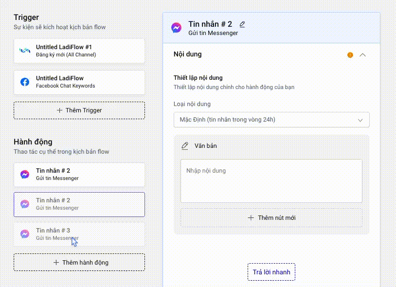

# Hành động (Action)

### Thêm mới hành động

Cách 1: Chọn Thêm hành động tại mục Hành động.

<figure><figcaption></figcaption></figure>

Cách 2: Dưới cùng nội dung 1 hành động, chọn Chọn hành động.

Cách 3: Sử dụng Flow Builder.

1. Chọn Thêm mới.
2. Chọn Tab Hành động.
3. Tìm và chọn hành động.

**Lưu ý:** **Số lượng hành động tối đa trong Flow là 50.**

### Thay đổi tên hành động

1. Chọn chi tiết hành động muốn đổi tên trong flow
2. Đưa con trỏ chuột vào vị trí tên hành động
3. Nhập tên mới

<figure><figcaption></figcaption></figure>

### Xoá hành động trong Flow

1. Di chuyển con trỏ chuột vào hành động muốn xoá
2. Chọn icon thùng rác để xoá

<figure><figcaption></figcaption></figure>

**Lưu ý:**&#x20;

* Không thể xoá hành động xếp trên cùng.
* Hành động xếp trên cùng tự động được nối với trigger

### Thay đổi thứ tự hành động

1. Chọn vào hành động muốn thay đổi
2. Kéo thả chuột xuống vị trí mong muốn

<figure><figcaption></figcaption></figure>
