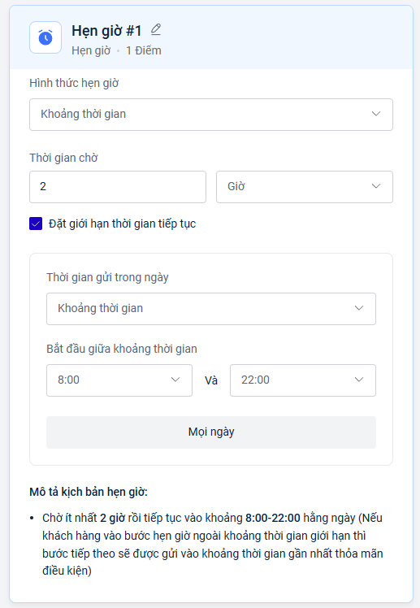

# Hẹn giờ

### Các bước thiết lập hành động Hẹn giờ

Khi bạn muốn hẹn giờ cho hành động tiếp theo trong Flow.

1. Chọn **+Thêm hành động**, tìm và chọn **trigger Hẹn giờ.**

<figure><figcaption></figcaption></figure>

2. **Thiết lập thông tin hẹn giờ**:

* **Theo Khoảng thời gian :** Bạn điền thông tin khoảng thời gian mong muốn.\
  Nếu bạn muốn giới hạn khoảng thời gian thực hiện hành động tiếp theo bạn chọn .

<figure><figcaption></figcaption></figure>

Sau đó tùy chỉnh thời gian chờ, đặt giới hạn thời gian tiếp tục (không bắt buộc).&#x20;

Nếu khách hàng vào bước Hẹn giờ ngoài khoảng thời gian giới hạn thì bước tiếp theo sẽ được gửi vào khoảng thời gian gần nhất thỏa mãn điều kiện.

* **Theo Ngày cụ thể:** Chọn ngày, giờ cụ thể.

Tùy chọn Tiếp tục kịch bản sau thời gian thiết lập theo mong muốn.

<figure><figcaption></figcaption></figure>

* **Theo Ngày tùy chỉnh:** Chọn trường thông tin của khách hàng.&#x20;

Sau đó tùy chỉnh thời gian chờ, đặt giới hạn thời gian tiếp tục và tùy chọn tiếp tục kịch bản sau thời gian thiết lập (không bắt buộc).

<figure><figcaption></figcaption></figure>

### Giải thích về tùy chọn "Tiếp tục kịch bản sau thời gian thiết lập"

Tùy chọn "Tiếp tục kịch bản sau thời gian thiết lập" quyết định việc flow có tiếp tục chạy hay không nếu khách hàng đến bước "Hẹn giờ" sau thời điểm hẹn giờ đã được thiết lập.

* **Trường hợp "Tiếp tục kịch bản sau thời gian thiết lập" KHÔNG được tích chọn:** Nếu khách hàng đến bước Hẹn giờ sau thời điểm đã được cài đặt trong "Hẹn giờ", luồng sẽ dừng lại tại bước đó. Bước tiếp theo của bước Hẹn giờ sẽ không được thực hiện.

<figure><figcaption></figcaption></figure>

_Ví dụ:_ Bạn thiết lập "Hẹn giờ" để gửi email vào 18:00 ngày 06/01/2025. Nếu khách hàng đến bước "Hẹn giờ" này vào lúc 20:00 ngày 06/01/2025  (tức là sau thời điểm 18:00 ngày 06/01/2025), email sẽ không được gửi và luồng sẽ kết thúc tại đây.

* **Trường hợp "Tiếp tục kịch bản sau thời gian thiết lập" ĐƯỢC tích chọn:** Nếu khách hàng đến bước "Hẹn giờ" sau thời điểm đã được cài đặt, luồng vẫn tiếp tục chạy đến các bước tiếp theo, bỏ qua việc chờ đợi thời gian đã định.

<figure><figcaption></figcaption></figure>

\
&#xNAN;_&#x56;í dụ:_ Vẫn với ví dụ trên, nếu bạn tích chọn tùy chọn này, và khách hàng đến bước "Hẹn giờ" vào lúc 20:00 ngày 06/01/2025, email vẫn sẽ được gửi ngay lập tức (hoặc thực hiện hành động tiếp theo được kết nối với bước "Hẹn giờ"), thay vì bị dừng lại.

Để nối 2 hành động trong cùng 1 Flow bạn xem thêm tại đây [lam-sao-de-noi-2-hanh-dong-trong-flow.md](../lam-sao-de-noi-2-hanh-dong-trong-flow.md "mention")
