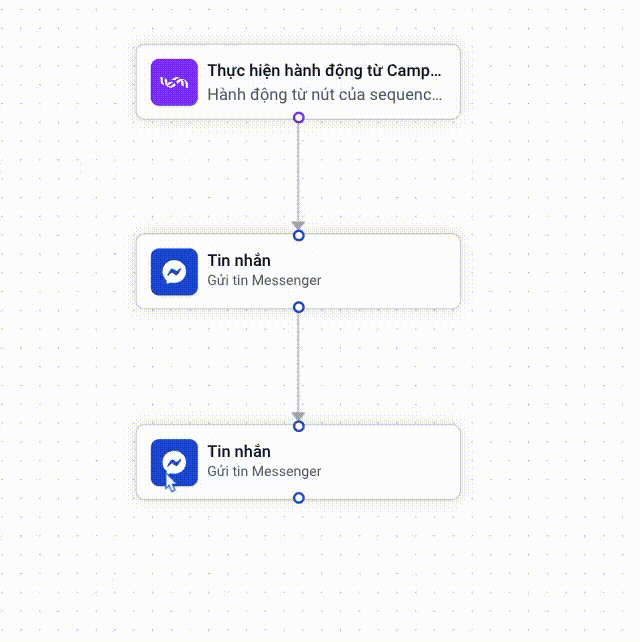

# Hướng dẫn sử dụng Flow Builder

Chuyển sang chế độ Flow Builder, bạn chọn **Chuyển sang Flow Builder**

<figure><figcaption></figcaption></figure>

### Các công cụ trong Builder

1. **Phóng to, thu nhỏ**

Ngoài việc chọn vào công cụ Phóng to, Thu nhỏ trên thanh công cụ, bạn có thể lăn chuột để phóng to và thu nhỏ Board theo vị trí khoảng cách mong muốn\

<figure><figcaption></figcaption></figure>

2. **Khoá thao tác**

Khoá các thao tác làm thay đổi vị trí của hành động và trigger trên Board.\

<figure><figcaption></figcaption></figure>

3. **Vừa khung hình**

Công cụ giúp bạn thay đổi kích thước của board hợp lý hơn.\

<figure><figcaption></figcaption></figure>

2. **Sắp xếp tự động**

Công cụ tự động làm đẹp Flow.\

<figure><figcaption></figcaption></figure>

### Thêm Trigger, hành động vào Flow

1. Chọn **+ Thêm mới,** sau đó tìm chọn Trigger, hành động mong muốn

<figure><figcaption></figcaption></figure>

2.  Kéo thả các hành động vào Board.\

    <figure><figcaption></figcaption></figure>

Nối các hành động lại thành chuỗi.\

<figure><figcaption></figcaption></figure>

### Xoá Trigger, hành động trong Flow

1. Di chuyển con trỏ chuột vào Trigger hoặc Hành động muốn xoá
2. Chọn vào icon thùng rác để xoá
3.  Xác nhận hành động xoá.\

    <figure><figcaption></figcaption></figure>

    **Lưu ý**: Hành động được nối với trigger sẽ không thể xoá. Để xoá hành động đó, hay nối trigger với hành động khác.

### Nhân bản hành động

Di chuyển con trỏ chuột vào hành động muốn nhân bản. Sau đó chọn vào icon nhân bản

<figure><figcaption></figcaption></figure>

Hành động mới sẽ có nội dung giống hệt tin nhắn được nhân bản và ở trạng thái chưa nối với bất kỳ hành động nào khác.

### Thêm/xoá liên kết giữa các hành động

**Thêm liên kết** giữa các hành động\

<figure><figcaption></figcaption></figure>

2. **Xoá liên kết**

Di chuyển con trỏ chuột vào các nút thông tin hoặc đường trên đường liên kết. Sau đó chọn vào icon thùng rác để xoá liên kết.

<figure><figcaption></figcaption></figure>

<figure><figcaption></figcaption></figure>
