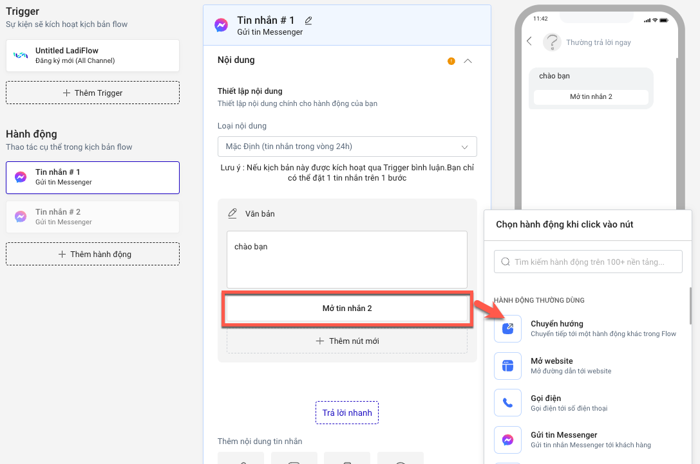
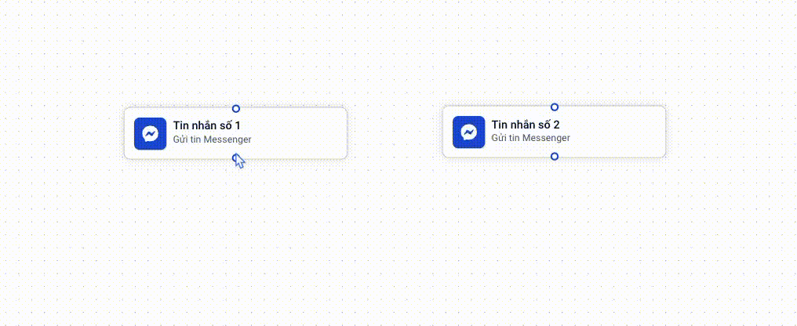
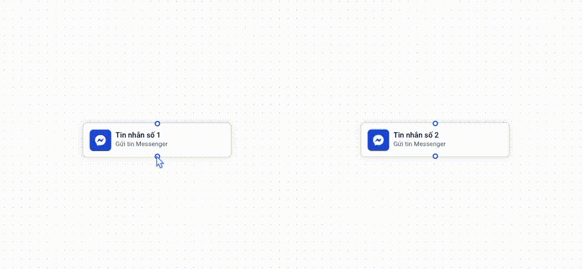

# Làm sao để nối 2 hành động trong Flow?

LadiFlow cung cấp 2 chế độ xây dựng Flow: Classic Builder và Flow builder

**Classic builder** là chế độ thiết kế cổ điển, giúp bạn có cái nhìn tổng quan về các trigger, hành động và preview flow.&#x20;

**Flow builder** giúp bạn thiết kế flow dưới dạng biểu đồ trình tự, cung cấp cái nhìn tổng quan về luồng hành động.&#x20;

Bạn có thể chuyển qua lại giữa 2 chế độ để tạo kịch bản thuận tiện và phù hợp nhất.

1. **Chế độ Classic Builder**

Khi tạo mới một Flow, hệ thống hiển thị mặc định ở chế độ này. Dưới đây là ví dụ nối chuỗi 2 hành động gửi tin nhắn Messenger. Để nối 2 hành động thành chuỗi bạn thực hiện như sau:

Nếu bạn muốn chuyển hướng hành động theo thao tác của khách hàng (ví dụ chọn vào nút):

* Chọn vào nút muốn chuyến hướng hành động, sau đó chọn **Chuyển hướng**.

<figure><figcaption></figcaption></figure>

* Chọn hành động muốn chuyển hướng khi chọn vào nút.

<figure><figcaption>
Chọn tin nhắn muốn chuyển hướng
</figcaption></figure>

Nếu  bạn muốn điều hướng trực tiếp từ Tin nhắn #1 sang Tin nhắn #2 bạn làm như sau:

* Chọn **Chọn hành động** tại cuối nội dung hành động đang chọn, sau đó chọn **Chuyển hướng.**

<figure><figcaption></figcaption></figure>

* Chọn hành động muốn điều hướng tới.

<figure><figcaption>
Chọn tin nhăn muốn chuyển hướng
</figcaption></figure>

2. **Chế độ Flow Builder**

Để chuyển sang chế độ Flow Builder, chọn **Chuyển sang Flow Builder.**

Để nối 2 hành động thành chuỗi, bạn làm như sau:

* Chọn điểm cuối hành động đầu, sau đó kéo chuột tới điểm đầu hành động thứ 2 sao cho tạo thành đường nối giữa 2 hành động.
*   Sau đó, chọn Bước tiếp theo nếu muốn hành động tiếp theo, hoặc chọn nút muốn hành động điều hướng tới.\

    <figure><figcaption>
Nối tiếp 2 tin nhắn 
</figcaption></figure>

    <figure><figcaption>
Nối tin nhắn theo nút
</figcaption></figure>


Bạn có thể thay đổi vị trí hành động trên board để dễ dàng thuận tiện bằng cách chọn vào hành động và giữ chuột kéo tới vị trí mong muốn.

