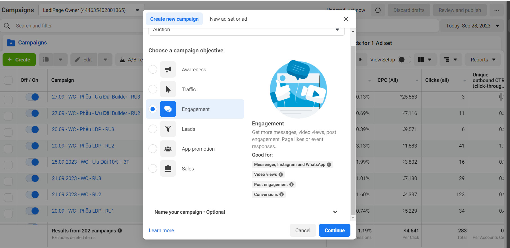
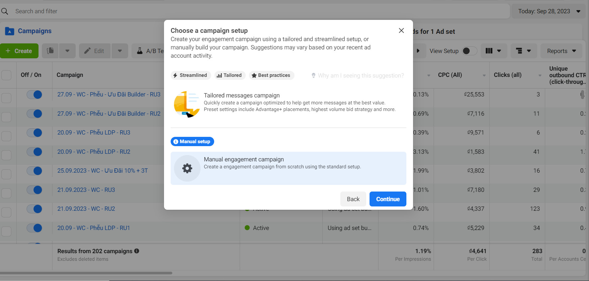
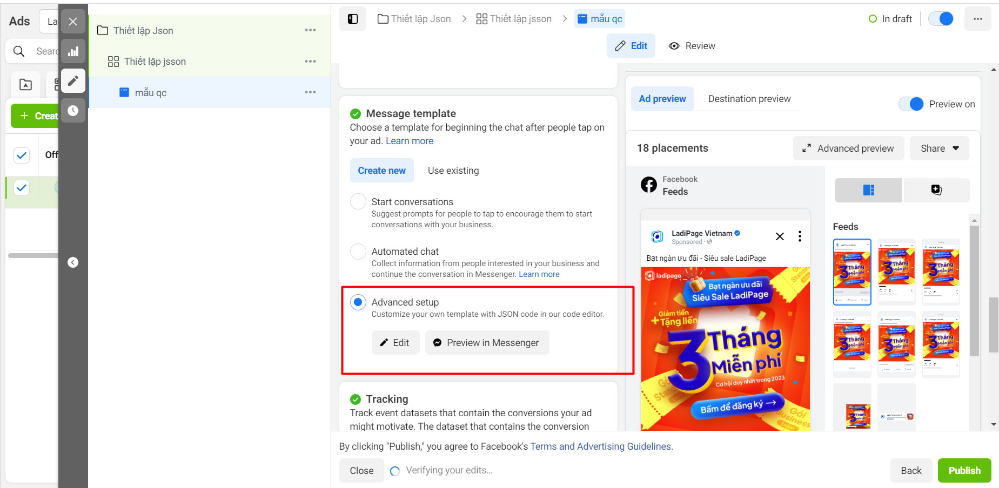
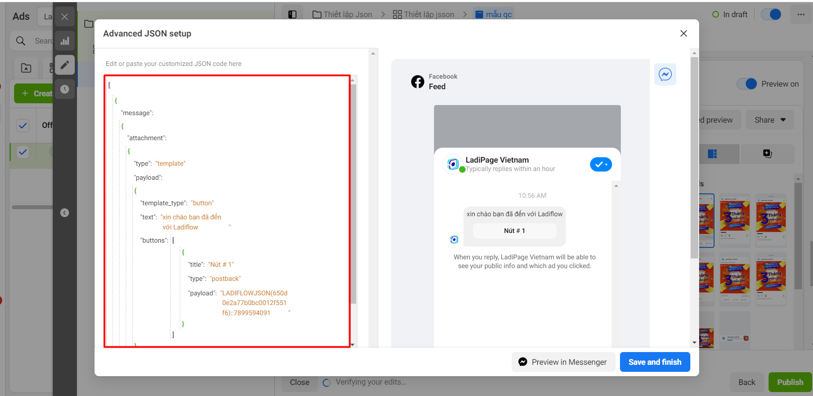
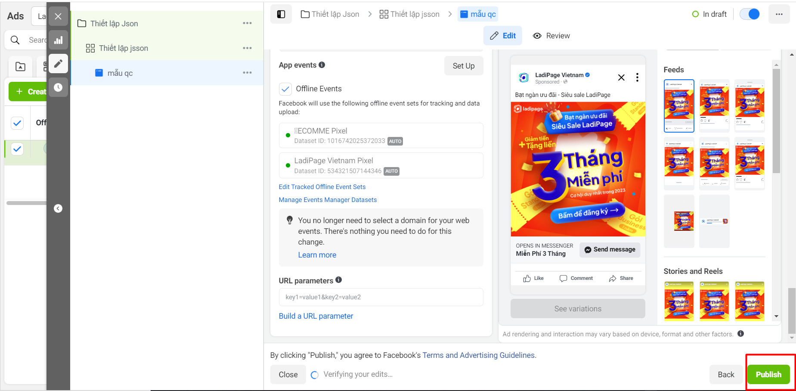

# Ads JSON

Trigger hoạt động khi có ai đó click vào quảng cáo Facebook của bạn


Hãy thiết lập Trigger trước để lấy đoạn mã json, sau đó thêm vào quảng cáo trên Facebook của bạn.


1.  Chọn **+ Thêm trigger,** tìm và chọn **Ads Json.**\

    <figure><figcaption></figcaption></figure>


Bạn có thể sử dụng công cụ tìm kiếm để tìm Trigger nhanh hơn


2.  **Chọn tài khoản Facebook cấu hình chạy quảng cáo.**\

    <figure><figcaption></figcaption></figure>
3. Chọn mục Thiết lập trigger, thêm điều kiện kích hoạt nếu muốn giới hạn tệp khách hàng trong flow. Xem thêm tại [them-dieu-kien-kich-hoat-trigger.md](../them-dieu-kien-kich-hoat-trigger.md "mention").
4. **Chọn kiểm tra tài khoản** để chắc chắn tài khoản của bạn đang hoạt độn&#x67;**.**
5. **Thêm hành động Gửi tin Messenger vào Flow.** Với các thiết lập tin nhắn Messenger đầu tiên khác nhau sẽ tạo ra đoạn mã json khác nhau.


**Hành động đầu tiên trong Flow có trigger Ads Json phải là gửi tin Messenger.**

**Để gửi các tin nhắn khác trong kịch bản, bạn cần thiết lập nút trong tin nhắn đầu tiên và nối kịch bản với các nút này.** Hành động tiếp theo sẽ không thể thực hiện được nếu khách hàng mới hoặc khách hàng có thời gian tương tác với page lớn hơn 24h.


### Thêm đoạn mã json vào quảng cáo của bạn

1. **Xem chi tiết Flow có chứa trigger Ads JSON bạn đã tạo.**
2. **Chọn chi tiết trigger Ads Json và Sao chép đoạn mã.**

<figure><figcaption></figcaption></figure>

3. **Tạo quảng cáo và dán mã json vào như hình dưới đây.**

Chọn **Engagement**, sau đó chọn **Continue**

<figure><figcaption></figcaption></figure>

Chọn **Continue**

<figure><figcaption></figcaption></figure>

Chọn **Advanced setup** và chọn **Edit**

<figure><figcaption></figcaption></figure>

Dán mã json vừa copy và chọn **Save and finish**

<figure><figcaption></figcaption></figure>

Cuối cùng chọn **Publish** để hoàn thành quảng cáo.

<figure><figcaption></figcaption></figure>

**Lưu ý**:&#x20;

* Chỉ khi trigger Ads JSON được kích hoạt thì đoạn mã json mới hoạt động trên quảng cáo của bạn.
* Khi có ai đó click vào quảng cáo được gắn json của LadiFlow, hệ thống tự động thêm mới khách hàng đó vào danh sách khách hàng của bạn trên LadiFlow nếu chưa có dữ liệu khách hàng đó.

**Gợi ý các hành động phù hợp với Trigger:**

* **Gửi tin nhắn Messenger**
* Hành động trên LadiFlow: gắn tag, bỏ tag, đăng ký Sequence....
