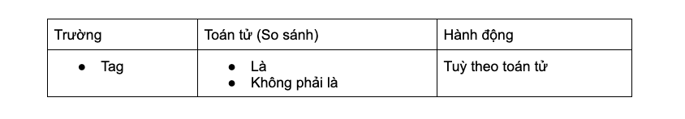

# Thêm điều kiện kích hoạt Trigger

### Đặt điều kiện kích hoạt

Đặt các điều kiện kích hoạt Trigger để giới hạn tập khách hàng áp dụng trigger. Trigger chỉ hoạt động với khách hàng thoả mãn điều kiện đã cài đặt. Bạn có thể đặt điều kiện theo:

**Theo Thông tin khách hàng**

<figure><figcaption></figcaption></figure>

**Theo thời gian**

<figure><figcaption></figcaption></figure>

**Theo Tag**

<figure><figcaption></figcaption></figure>

**Theo trường tuỳ chỉnh**

<figure><figcaption></figcaption></figure>

Tuỳ theo kiểu dữ liệu tại trường đó, hệ thống sẽ hiển thị các toán tử cho phép tương ứng. Bạn cần điền giá trị so sánh cho từng điều kiện.

### Thêm nhóm điều kiện

Có thể đặt các nhóm điều kiện hoặc (OR) khác nhau với cùng 1 Trigger bằng cách chọn Thêm nhóm điều kiện.

Dưới đây là ví dụ điều kiện kích hoạt Trigger: Khách hàng có Họ và tên là Minh có năm sinh lớn hơn 1995 hoặc các khách hàng có năm sinh nhỏ hơn hoặc bằng 1995.

<figure><figcaption></figcaption></figure>

### Xoá 1 điều kiện

Để xoá 1 điều kiện chọn vào icon Thùng rác tại điều kiện muốn xoá.

<figure><figcaption></figcaption></figure>
