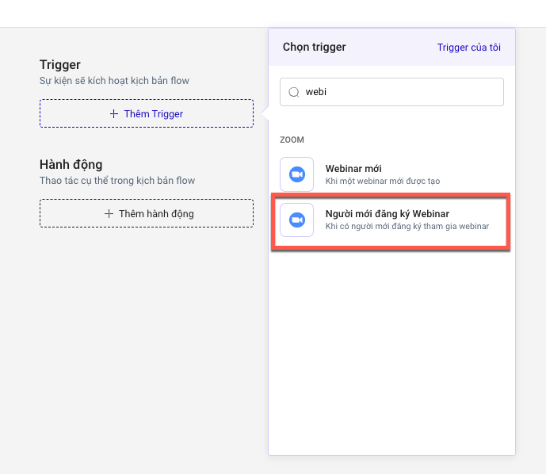

# Người mới đăng ký Webinar

Trigger hoạt động khi có người mới đăng ký tham dự hội thảo trực tuyến trên Zoom.&#x20;

**Lưu ý:**

* Trigger được hoạt động khi thời điểm kích hoạt trigger mà webinar của bạn chưa diễn ra.

**Gợi ý các hành động phù hợp với Trigger:**

* **Gửi Email**&#x20;
* Hành động trên LadiFlow: gắn tag, bỏ tag, đăng ký Sequence....
* SMS, AI Call, Zalo ZNS nếu có thông tin số điện thoại khách hàng trên LadiFlow.

1. Chọn **+Thêm Trigger**, sau đó tìm và chọn trigger **Người mới đăng ký Webinar.**

<figure><figcaption></figcaption></figure>

2.  **Chọn tài khoản Zoom cấu hình**, đây là tài khoản có các hội thảo trực tuyến. Nếu chưa có tài khoản hãy tích hợp thêm.\

    <figure><figcaption></figcaption></figure>
3. **Mở mục Thiết lập Trigger**, điền các thông tin Điều kiện kích hoạt nếu muốn giới hạn tập khách hàng trong flow. Xem thêm tại [them-dieu-kien-kich-hoat-trigger.md](../them-dieu-kien-kich-hoat-trigger.md "mention").
4.  **Chọn cuộc họp sắp diễn ra.** Đây là webinar sắp diễn ra của bạn.\

    <figure><figcaption></figcaption></figure>
5. **Kiểm tra tài khoản zoom**, đảm bảo rằng tài khoản của bạn đang hoạt động.
