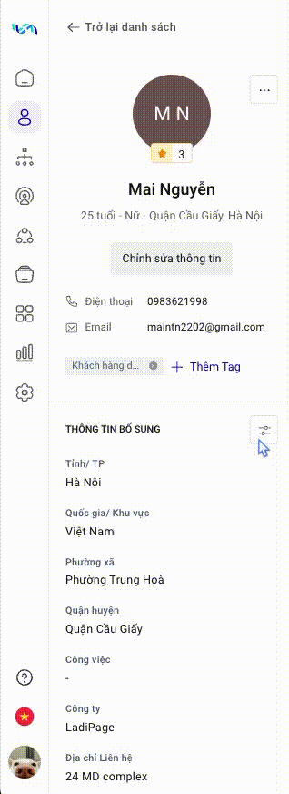

# Xem chi tiết khách hàng

LadiFlow cung cấp chi tiết tương tác từng khách hàng giúp doanh nghiệp hiểu rõ hơn về nhu cầu, sở thích và hành vi của khách hàng, từ đó tạo ra các chiến lược marketing và dịch vụ phù hợp với các khách hàng.

* Thông tin chi tiết khách hàng
* Tổng quan
* Tương tác trong:Flow, Sequence, Campaign
* Các hành động&#x20;
* Đơn hàng: tất cả các đơn hàng của khách hàng trên tất cả các nền tảng.
* Ghi chú của khách hàng

**Để xem chi tiết khách hàng**, bạn chọn vào tên khách hàng muốn xem tại màn hình quản lý khách hàng.

### Thông tin chi tiết khách hàng

Các thông tin của khách hàng được hiển thị phía bên trái màn hình theo chiều dọc.

<figure><figcaption></figcaption></figure>

Sử dụng công cụ sắp xếp để thay đổi thứ tự thông tin hiển thị bằng cách kéo thả các thông tin như hình dưới đây.

<figure><figcaption></figcaption></figure>

Thứ tự hiển thị thông tin dữ liệu sẽ được cập nhật trên tất cả khách hàng của bạn.

### Tổng quan

<figure><figcaption></figcaption></figure>

* **Doanh thu**: LadiFlow tổng hợp các dữ liệu đơn hàng trên tất cả các nền tảng khi bạn có kích hoạt các trigger liên quan đến đơn hàng.
* **Lượt tương tác**: LadiFlow cung cấp các số liệu tổng quan tổng số lượng Flow, Campaign, Sequence mà khách hàng đã tương tác.
* **Top kênh nhận tin nhắn:** giúp bạn tổng quan sự tương tác của khách hàng qua các kênh, từ đó tạo các chiến lược phù hợp.
* **Top thiết bị khách hàng sử dụng:** tổng quan tỷ lệ sử dụng các thiết bị tương tác với các chiến lược của bạn.
* **Hoạt động gần đây:** Các hoạt động của khách hàng trong vòng 3 ngày.

### Tương tác của khách hàng

Bạn có thể xem thống kê chi tiết các tương tác của từng khách hàng trên Flow, Sequence, Campaign.\

<figure><figcaption></figcaption></figure>

Từ đó, doanh nghiệp có thể thấu hiểu người tiêu dùng nhiều hơn, tiếp cận với họ nhiều hơn và biết cách để cải thiện sản phẩm, dịch vụ ngày một hoàn thiện.

### Đơn hàng

Ngay sau khi bạn tích hợp tài khoản các nền tảng khác: LadiSales, Sapo, KiotViet... với LadiFlow, hệ thống sẽ tự động cập nhật dữ liệu khách hàng bạn tạo mới và đơn hàng.

LadiFlow giúp bạn theo dõi tất cả các đơn hàng của 1 khách hàng trên tất cả các nền tảng bạn tương tác.&#x20;

Hệ thống giúp bạn quản lý đơn hàng theo khách hàng, từ đó giúp bạn và doanh nghiệp tạo các chiến dịch quảng bá phù hợp.

<figure><figcaption></figcaption></figure>

### Hoạt động

Chọn tab **Hoạt động** trên màn hình chi tiết khách hàng để xem danh sách các hoạt động của khách hàng đó.

<figure><figcaption></figcaption></figure>

Bạn có thể theo dõi hoạt động của khách hàng theo khoảng thời gian mong muốn.

### Ghi chú

Bạn có thể xem các ghi chú bạn đã thêm cho khách hàng đó theo thời gian.

<figure><figcaption></figcaption></figure>

Bạn có thể thêm ghi chú bằng cách nhập nội dung và chọn **Lưu ghi chú**.

### Gộp khách hàng

Tính năng giúp bạn chuẩn hoá dữ liệu trong tập khách hàng của bạn. Do dữ liệu khách hàng đến từ nhiều nguồn, nền tảng khác nhau nên sẽ có những dữ liệu với cùng 1 khách hàng nhưng có từ 2 bản ghi trở lên trên LadiFlow.&#x20;

1. Chọn **Gộp khách hàng.**

<figure><figcaption></figcaption></figure>

2. **Nhập email** khách hàng muốn gộp, nhấn **Enter** và **chọn khách hàng** .
3. Chọn các thông tin muốn giữ khi gộp 2 khách hàng.

<figure><figcaption></figcaption></figure>

4. Chọn **Lưu**.

**Lưu ý**:&#x20;

* Email của khách hàng mới sau khi gộp sẽ lấy theo khách hàng đầu tiên.
* Lịch sử đơn hàng, tương tác của 2 khách hàng sẽ được gom lại.
