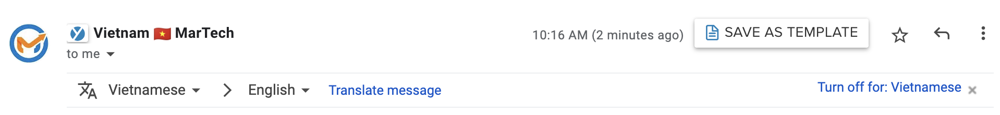

# Các cách xác thực danh tính người gửi Email

Khi bạn gửi email, các nhà cung cấp hộp thư (chẳng hạn như Gmail, Outlook, Zalo và Yahoo) cần xác định xem thư có phải là email hợp pháp được gửi từ chủ sở hữu tên miền hoặc địa chỉ email hay không hay email giả mạo được gửi bởi kẻ gửi thư rác hoặc kẻ lừa đảo. Để đảm bảo không bị kẻ gian lợi dụng, hầu hết các nhà cung cấp dịch vụ email marketing đều cung cấp các phương pháp xác thực email hoặc tên miền email hay hiểu nôm na là xác minh danh tính của người gửi.

Có 3 phương pháp xác minh danh tính của người gửi, đó là **SPF, DKIM** và **DMARC**.

Lý do tại sao **bạn nên** **thiết lập các phương pháp xác thực danh tính này vì một số lý do:**

1.  Nó giúp xoá bỏ tiêu đề "via..." khỏi Gmail\
    &#x20;Điều này giúp củng cố thương hiệu. Như hình minh hoạ bên dưới

    <figure><figcaption>
Trước khi xác thực danh tính bằng DKIM
</figcaption></figure>

<figure><figcaption>
Sau khi xác thực danh tính email
</figcaption></figure>

2. &#x20;**Xây dựng danh tiếng với tư cách là người gửi email trên tên miền của riêng bạn**

&#x20;Gửi email mà không xác thực danh tính giống như làm bài tập về nhà mà không có tên bạn trong phần bài nộp vậy. Bạn có thể đã hoàn thành nhiệm vụ, nhưng bạn không thể được công nhận vì cô giáo/thầy giáo đâu biết bài đó thực sự là của ai đâu. Xác thực DKIM sẽ giúp bạn.

3. &#x20;**Bảo mật chặt chẽ hơn cho tên miền của bạn**

&#x20;Tiêu chuẩn xác thực như DMARC sẽ giúp bạn bảo vệ tên miền của bạn khỏi việc sử dụng gian lận tiềm ẩn từ kẻ gian.

_Để nâng cao khả năng phân phối và hiệu quả của mỗi chiến dịch email thì người gửi phải tuân theo các phương pháp hay nhất như gửi email với nội dung chất lượng cao, được cá nhân hoá đến danh sách người nhận và thường xuyên vệ sinh sạch sẽ danh sách của mình._

**LadiFlow cung cấp 3 phương pháp xác thực cơ bản và thường được sử dụng nhất đó là DKIM, SPF, DMARC.**

### **DKIM**

DKIM viết tắt của Domain Keys Identified Mail, là một phương thức giúp xác nhận các email thông qua chữ ký số của miền gửi thư, việc này giúp tránh email giả mạo, mục đích chính ban đầu của DKIM được thiết kế ra là để người nhận có thể xác định email đến từ tên miền cụ thể nào, tên miền đó thật không, có được ủy quyền hay không.

Ví dụ: Một công ty có tên là LadiLab có tên miền ladilab.vn. Họ sử dụng một chữ ký số gắn với tên miền ladilab.vn cho các email họ gửi đi để xác nhận rằng các email đó là gửi bởi "LadiLab".

Để thiết lập DKIM với LadiFlow:

1. &#x20;Đăng nhập vào tài khoản LadiFLow
2. Bấm vào menu **Cài đặt**
3. Chọn **Quản lý tên miền**
4. Bấm vào nút "**Thêm tên miền**"
5. Nhập tên miền và bấm nút "**Thêm tên miền**".


**Lưu ý:** bạn chỉ nên nhập tên miền mà có sử dụng để tạo tài khoản email tên miền. \
&#xNAN;_&#x56;í dụ: support@ladilab.vn thì tôi nhập ladilab.vn, info@startupcity.vn thì tôi nhập startupcity.vn_


LadiFlow sẽ thêm tên miền vào hệ thống và tự động tạo các bạn ghi xác thực DKIM cho tên miền.

6. **Bấm vào dấu "..." ở dòng tên miền cần lấy bản ghi, sau đó chọn "Xác thực"**

Màn hình hiển thị bản ghi DKIM dưới dạng TXT để bạn định cấu hình vào máy chủ DNS tại tên miền của bạn.

<figure><figcaption>
Bản ghi DKIM
</figcaption></figure>

Để thuận tiện, đây là một số link giúp bạn dễ dàng thao tác hơn:​

* [Hướng dẫn​ thêm bản ghi tại các trang quản lý tên miền](../cach-tao-ban-ghi-theo-ten-mien-tren-cac-website-quan-ly-ten-mien/)
* [cac-luu-y-khi-gui-email-bang-domain-cua-ban.md](cac-luu-y-khi-gui-email-bang-domain-cua-ban.md "mention")
* [cac-van-de-gap-phai-khi-gui-email.md](cac-van-de-gap-phai-khi-gui-email.md "mention")


**Lưu ý**: Trạng thái xác thực trên LadiFlow là trạng thái xác thực DKIM. Để kiểm tra các phương thức khác, vui lòng xem hướng dẫn tại [#chu-dong-kiem-tra-xac-thuc-danh-tinh-dkim-spf-dmarc](cac-luu-y-khi-gui-email-bang-domain-cua-ban.md#chu-dong-kiem-tra-xac-thuc-danh-tinh-dkim-spf-dmarc "mention")


### **SPF**

Chứng thực SPF (SPF Record – Sender Policy Framework) là một hệ thống đánh giá email nhằm phát hiện email có phải được giả mạo hay không nhờ vào cơ chế cho phép hệ thống nhận email, kiểm tra email được gởi từ một domain có được xác định bởi người quản trị domain.

Danh sách những máy chủ (host) sử dụng để gửi email được thông báo trong bảng ghi của DNS dưới dạng bảng ghi tên là TXT.

Email gửi spam thường sử dụng địa chỉ email gửi giả mạo, vì vậy **SPF được xem như là một kỹ thuật dùng để loại trừ email spam**.

**Cấu hình SPF mang đến lợi ích gì?**

* Tăng độ tin tưởng với hệ thống bên nhận hơn khi nhận mail đến từ domain có khai báo SPF.
* Nhận được sự ưu tiên của Gmail, Yahoo khi kiểm tra nhờ vào các email gửi từ domain có khai báo SPF.

**Cấu hình bản ghi SPF đã có của LadiFlow**

LadiFlow đã tạo sẵn 1 bản ghi xác thực spf, bạn cần phải chỉnh sửa bản ghi này nếu đang dùng email cho **2 hệ thống song song để gửi/nhận email.**

1. Bạn cần chọn Mail server theo tên miền của mình để hệ thống tạo ra bản ghi tương ứng.
2. Tạo bản ghi DNS theo dữ liệu bản ghi hệ thống vừa tạo.
3. Chờ bản ghi được áp dụng và thực hiển gửi mail để kiểm tra xác thực SPF. Xem hướng dẫn tại [#chu-dong-kiem-tra-xac-thuc-danh-tinh-dkim-spf-dmarc](cac-luu-y-khi-gui-email-bang-domain-cua-ban.md#chu-dong-kiem-tra-xac-thuc-danh-tinh-dkim-spf-dmarc "mention")

Bạn chỉ có thể tạo một bản ghi SPF cho tên miền của mình. Nếu bạn có bản ghi SPF hiện có, bạn sẽ cần phải sửa đổi bản ghi hiện có của mình thay vì tạo bản ghi SPF mới. Chúng tôi khuyến cáo bạn nên xóa bản ghi đó đi, tạo bản ghi kết hợp để thời gian áp dụng vào tên miền sẽ nhanh hơn, xem hướng dẫn gộp bản ghi tại [#luu-y-khi-xac-thuc-spf](cac-luu-y-khi-gui-email-bang-domain-cua-ban.md#luu-y-khi-xac-thuc-spf "mention")


Để kết hợp nhiều mail server, bạn thêm lần lượt thông tin các mail server vào value/destination theo định dạng: include:\<mail server>. Với 1 bản ghi TXT, tối đa 10 mail server bạn có thể thêm.


### **DMARC** 

DMARC (Domain-based Message Authentication, Reporting & Conformance) là một tiêu chuẩn để chặn spammer khỏi việc sử dụng domain của người sở hữu mà không được sự cho phép của họ mà ta hay gọi nó là spoofing. Thực tế, khi sử dụng mail, bất kỳ ai cũng có thể giả mạo địa chỉ tại trường “From” trong mail gửi đi một cách dễ dàng. DMARC sẽ đảm bảo những mail giả mạo này sẽ bị chặn trước khi chúng đến được mailbox của người nhận và hơn thế nữa, chỉ những mail hợp lệ mới được chấp nhận vào hệ thống.

Ladiflow tự động hiển thị bản ghi tại danh sách bản ghi. Bạn cần tạo bản ghi này ở trang quản lý tên miền.

<figure><figcaption>
Bản ghi DMARC
</figcaption></figure>

Sau khi tạo bản ghi, bạn chờ ít nhất 5 phút để bản ghi áp dụng. Sau đó thực hiện kiểm tra bằng cách gửi thử 1 email. Sau đó chọn Hiển thị thư gốc

<figure><figcaption></figcaption></figure>

Trạng thái xác thực sẽ được hiển thị tại nội dung thư:

<figure><figcaption></figcaption></figure>

### **BIMI** 

BIMI (Brand Indicators for Message Identification) là một tiêu chuẩn mới được xây dựng dựa trên DMARC. Nó cho phép chủ sở hữu miền đã triển khai DMARC ở chế độ Thực thi Verified Mark Certificate (VMC) để hiển thị biểu trưng BIMI cho thương hiệu của họ trong email. Điều này mang lại cho người nhận một cách dễ dàng để xác định các thư đáng tin cậy một cách trực quan.

<figure><figcaption></figcaption></figure>

Vì BIMI là một tiêu chuẩn mới nên nó vẫn chưa được chủ sở hữu miền hoặc nhà cung cấp hộp thư chấp nhận rộng rãi và bạn không cần thiết lập BIMI. Tuy nhiên, nếu bạn muốn tìm hiểu thêm, bạn có thể xem lại các trang web sau:

* ​[https://bimigroup.org/](https://bimigroup.org/)​
* ​[https://www.emailonacid.com/blog/article/email-marketing/bimi/](https://www.emailonacid.com/blog/article/email-marketing/bimi/)​
* ​[https://authindicators.github.io/rfc-brand-indicators-for-message-identification/](https://authindicators.github.io/rfc-brand-indicators-for-message-identification/)​

#### Đọc thêm 

Trong bài viết này, chúng tôi không cố gắng giải thích quy trình kỹ thuật về cách hoạt động của SPF, DKIM, DMARC và BIMI. Mỗi giao thức xác thực này đều có một trang web công khai nơi thông số kỹ thuật được giải thích chuyên sâu:

* ​[SPF](http://www.open-spf.org/)​
* ​[DKIM](https://en.wikipedia.org/wiki/DomainKeys_Identified_Mail)​
* ​[DMARC](https://dmarc.org/)​
* ​[BIMI](https://authindicators.github.io/rfc-brand-indicators-for-message-identification/)
