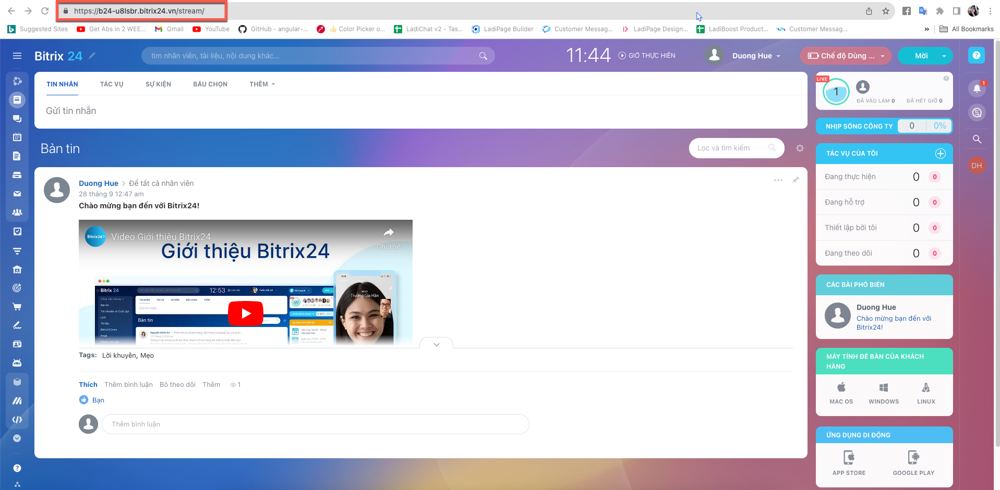
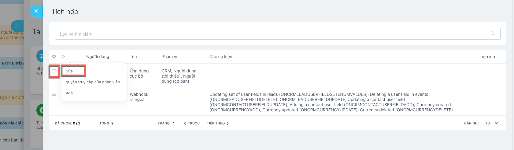

# Tích hợp Bitrix24

### Thêm tích hợp Bitrix24

1. Tìm và chọn ứng dụng **Bitrix24**.

<figure><figcaption></figcaption></figure>

2. Chọn **Thêm liên kết**.
3. Điền đường dẫn tới Bitrix của bạn vào API URL.&#x20;

<figure><figcaption></figcaption></figure>

### Thêm ứng dụng trên Bitrix24

1. Mở 1 cửa sổ trình duyệt mới, **truy cập Bitrix24 và đăng nhập với tài khoản của bạn.**
2. **Tạo 1 ứng dụng cục bộ .**
   * Chọn **Ứng dụng**, sau đó chọn **Tài nguyên cho nhà phát triển.**
   * Chọn **Khác**
   * Chọn **Ứng dụng cục bộ**
   * Điền các thông tin để tạo. Trong đó **Đường dẫn xử lý và đường dẫn cài đặt ban đầu** bạn điền đường dẫn **URL chuyển hướng trên LadiFlow .**

<figure><figcaption></figcaption></figure>

* Thông tin các quyền:CRM, người dùng (tối thiểu), người dùng (cơ bản).
* Chọn **Lưu**.&#x20;

3. **Tạo tương tự 1 ứng dụng Webhook ra ngoài.**

* **Cài Đặt**, chọn T**ài nguyên cho nhà phát triển**, sau đó chọn **Khác**. Chọn **Webhook ra ngoài.**
* Điền thông tin vào form sau đó chọn **Lưu.**
*   **URL xử lý** **của bạn**: dán **Url webhook từ form LadiFlow.**\

    <figure><figcaption></figcaption></figure>
* Chọn các sự kiện: Contact updated, contact created, deal created, deal updated

<figure><figcaption></figcaption></figure>

### Nhập các thông tin vào form thêm mới liên kết trên LadiFlow với dữ liệu bạn vừa tạo

1. Trên Bitrix24 đóng tab Khác, **chọn Tích hợp.**

<figure><figcaption></figcaption></figure>

Chọn **ứng dụng cục bộ bạn vừa tạo**, chọn **Sửa**.

<figure><figcaption></figcaption></figure>

2. **Copy client\_id paste vào Client ID trên form thêm liên kết LadiFlow.**

<figure><figcaption></figcaption></figure>

3. **Copy Khóa ứng dụng (client\_secret)** paste vào **Client Secret trên form thêm liên kết LadiFlow.**

<figure><figcaption></figcaption></figure>

4. **Chọn Xác thực**, **điền Tên liên kết** và **chọn Lưu liên kết.**

<figure><figcaption></figcaption></figure>

**Hiện tại hệ thống không giới hạn số tích hợp Bitrix24.**
