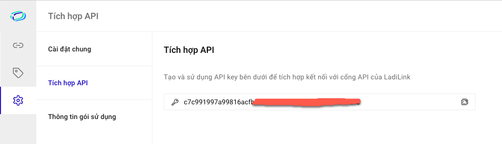

# Tích hợp LadiLink

### Các bước tích hợp LadiLink

1. Tìm và chọn ứng dụng **LadiLink** trên danh sách ứng dụng tích hợp

<figure><figcaption></figcaption></figure>

2. Chọn **Thêm liên kết**

<figure><figcaption></figcaption></figure>

3. Mở thêm 1 cửa sổ trình duyệt, truy cập LadiLink và đăng nhập với tài khoản của bạn
4. Tại LadiLink, chọn Cài đặt, sau đó chọn Tích hợp API. Sao chép API key và dán vào form thêm mới liên kết trên LadiFlow

<figure><figcaption></figcaption></figure>

5. Đặt tên tích hợp và chọn **Lưu liên kết**

**LadiLink** là ứng dụng giúp bạn rút gọn các đường dẫn phù hợp gắn link vào email, tin nhắn...

**Lưu ý**: Với mỗi tài khoản, chỉ được 1 tích hợp LadiLink.
