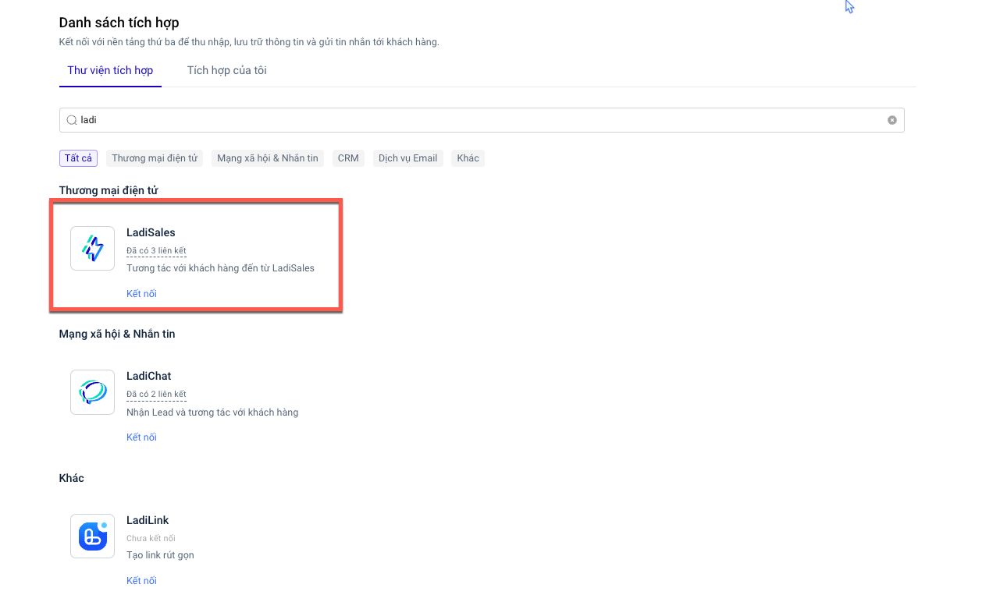

# Tích hợp LadiSales (LadiPage Ecommerce)

### Tích hợp LadiSales (LadiPage Ecommerce)



Kể từ sau thời điểm tích hợp LadiSales trên LadiFlow thành công:

* Tất cả khách hàng mới tạo đều được đồng bộ sang LadiFlow
* Tất cả đơn hàng mới tạo, cập nhật, huỷ sẽ cập nhật dữ liệu khách hàng đã có hoặc tạo mới khách hàng
* Tự động cập nhật các thông tin chỉ số liên quan đến đơn hàng của bạn và của từng khách hàng

1. **Tìm ứng dụng LadiSales.**

<figure><figcaption></figcaption></figure>

2. **Chọn Thêm liên kết.**
3. **Mở thêm 1 cửa sổ trình duyệt, truy cập LadiSales và đăng nhập** với tài khoản của bạn.&#x20;
4. C**họn Cài đặt, sau đó chọn API.**

<figure><figcaption></figcaption></figure>

5. **Copy API key.**

<figure><figcaption></figcaption></figure>

6. **Dán vào phần API key trên form của LadiFlow**. **Điền tên tích hợp và chọn lưu liên kết.**

<figure><figcaption></figcaption></figure>

7. Truy cập **Cài đặt,** sau đó chọn **Tích hợp.** **Copy API key** tại mục Kết nối API.

&#x20;&#x20;

<figure><figcaption></figcaption></figure>

8. **Truy cập LadiSales, Chọn Cài đặt**, sau đó chọn **Webhook.**
9.  **Chọn Thêm Webhook,** điền các thông tin như mẫu form dưới đây, và chọn **Lưu**.\
    API Url: [https://api.service.ladiflow.com/1.0/webhook/ladisales](https://api.service.ladiflow.com/1.0/webhook/ladisales)\
    **API Request Header** bạn điền như format sau :\
    {"Api-Key": "api key của ladiflow bạn vừa copy"}\
    \
    Lưu ý: Cần tích chọn hết các quyền cho phép trên LadiSales.\

    <figure><figcaption></figcaption></figure>

**Hiện tại hệ thống không giới hạn số tích hợp LadiSales.**

### Các trạng thái đơn hàng của LadiSales

<table><thead><tr><th width="193">Tên trường</th><th width="220">Mã trường</th><th>Giá trị</th></tr></thead><tbody><tr><td>Last Order Status</td><td>last_order_status</td><td><ul><li>Open: Đơn hàng mở</li><li>Cancel: Đơn bị hủy</li></ul></td></tr><tr><td>Last order shipping status</td><td>last_order_shipping_status</td><td><ul><li>Pending: Chưa giao</li><li>ReadyToPick: Đã đóng gói</li><li>Delivering: Đang giao</li><li>Delivered: Đã giao</li><li>DeliveredToPostMan: Đã giao cho bưu tá</li><li>Returning: Đang hoàn trả</li><li>Returned: Hoàn trả</li><li>Canceled: Đã hủy</li></ul></td></tr><tr><td>Last Order Payment Status</td><td>last_order_payment_status</td><td><ul><li>Pending: Chưa thanh toán</li><li>Success: Đã thanh toán</li></ul></td></tr><tr><td>Last Order Payment Method</td><td>last_order_payment_method</td><td><ul><li>COD: COD</li><li>ZALO_PAY: Zalo pay</li><li>MOMO: MoMo</li><li>VN_PAY: VnPay</li><li>ALE_PAY: AlePay</li><li>BANK: Chuyển khoản</li><li>VNPT_EPAY: Vnpt Epay</li><li>SHOPEE_PAY: ShoppePay</li><li>PAYPAL: Paypal</li><li>STRIPE: Stripe</li><li>APPOTA: Appotal pay</li><li>FINAN: Finan(Sổ bán hàng)</li></ul></td></tr></tbody></table>

### Lưu dữ liệu từ LadiSales vào trường tùy chỉnh

**Danh sách mã QR check-in sự kiện từ đơn hàng LadiSales**

* Tên hiển thị: Danh sách mã QR check-in sự kiện
* Tên trường: `lds_last_qr_code_urls`
* Kiểu dữ liệu: Danh sách

**Danh sách URL check-in sự kiện từ đơn hàng LadiSales**

* Tên hiển thị: Danh sách URL check-in sự kiện
* Tên trường: `lds_last_checkin_urls`
* Kiểu dữ liệu: Danh sách

**Mã QR thanh toán chuyển khoản qua ngân hàng**

* Tên hiển thị: Mã QR thanh toán chuyển khoản qua ngân hàng
* Tên trường: `qr_url`
* Kiểu dữ liệu: Dòng văn bản


Mã QR thanh toán chuyển khoản qua ngân hàng được thiết lập trên form checkout trong landing page của bạn.&#x20;

Hướng dẫn thiết lập vui lòng tham khảo tại đây:

* [Thêm Form Checkout](https://help.ladipage.vn/form-checkout/them-form-checkout#them-moi-form-checkout)
* [Kết nối API ngân hàng](https://ecommerce.help.ladipage.vn/thiet-lap/phuong-thuc-thanh-toan/chuyen-khoan-qua-ngan-hang/ket-noi-api-ngan-hang)


**Tổng số lượng tất cả sản phẩm của đơn hàng gần nhất**&#x20;

* Tên hiển thị: Tổng số lượng tất cả sản phẩm của đơn hàng gần nhất&#x20;
* Tên trường: `last_order_total_quantity`
* Kiểu dữ liệu: Dạng số

**Danh sách tên và số lượng từng sản phẩm của đơn hàng gần nhất**

* Tên hiển thị: Danh sách tên và số lượng từng sản phẩm
* Tên trường: `last_order_quantity_of_products`
* Kiểu dữ liệu: Danh sách

**Các trường tùy chỉnh của đơn hàng LadiSales**

Các dữ liệu trường tùy chỉnh đơn hàng LadiSales sẽ được lưu vào thông tin khách hàng đặt đơn nếu bạn tạo tương ứng các trường tùy chỉnh đó trên LadiFlow.&#x20;


**Lưu ý:** Bạn cần tạo trường dữ liệu cùng mã trường và kiểu dữ liệu trên LadiFlow và LadiSales để lưu dữ liệu.

Ví dụ:&#x20;

* Trường tùy chỉnh trên LadiFlow:

Mã trường: truong\_tuy\_chinh

Kiểu dữ liệu: Dạng số

* Trường tùy chỉnh đơn hàng trên LadiSales:

Mã trường: truong\_tuy\_chinh

Kiểu dữ liệu: Dạng số

