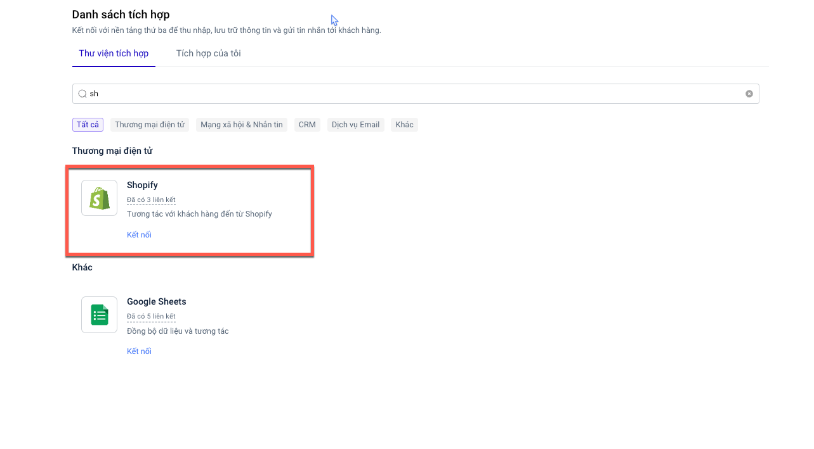

# Tích hợp Shopify

Kể từ sau thời điểm tích hợp Shopify trên LadiFlow thành công:

* Tất cả khách hàng mới tạo đều được đồng bộ sang LadiFlow
* Tất cả đơn hàng mới tạo, cập nhật, huỷ sẽ cập nhật dữ liệu khách hàng đã có hoặc tạo mới khách hàng
* Tự động cập nhật các thông tin chỉ số liên quan đến đơn hàng của bạn và của từng khách hàng

1. Tìm và chọn ứng dụng **Shopify.**

<figure><figcaption></figcaption></figure>

2. Chọn **Thêm liên kết.**
3. Điền đường dẫn shopify của bạn vào **API URL**, điền tên tích hợp và chọn **Lưu liên kết.**
4. **Sao chép Url Webhook.**
5.  Truy cập vào Shopify, chọn **Cài đặt**, sau đó chọn **Thông báo**.\

    <figure><figcaption></figcaption></figure>
6. Kéo xuống cuối trang, chọn **Tạo Webhook**.

<figure><figcaption></figcaption></figure>

7. Điền thông tin vào biểu mẫu tạo hook và chọn **Lưu**:
   * Sự kiện: Tạo khách hàng
   * Định dạng: JSON
   * URL: đường dẫn bạn vừa copy ở bước 4.
8. Tạo thêm 1 webhook nữa với nội dung như sau:
   * Sự kiện: Tạo đơn hàng
   * Định dạng: JSON
   * URL: đường dẫn bạn vừa copy ở bước 4.

**Hiện tại hệ thống không giới hạn số tích hợp Shopify.**
