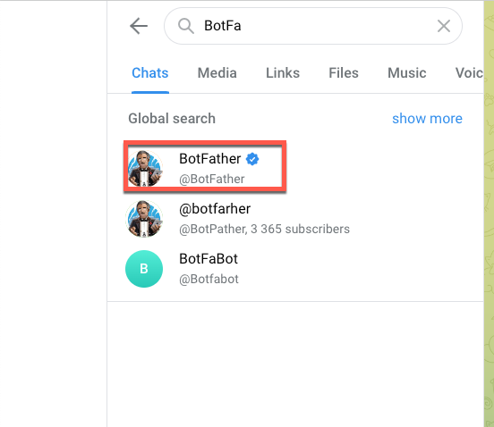

# Tích hợp Telegram

### Tích hợp Telegram

Bạn cần phải tích hợp BotFather vào telegram của bạn, sau đó kết nối chưa Bot đó với LadiFlow để thực hiện gửi thông báo Telegram qua Bot.

#### Thêm Father bot vào group chat của bạn

1. **Mở ứng dụng Telegram, tìm kiếm BotFather.**

<figure><figcaption></figcaption></figure>

2\. **Bắt đầu cuộc trò chuyện.**

<figure><figcaption></figcaption></figure>

2\. Nhập **/newbot** vào ô chat.

<figure><figcaption></figcaption></figure>

3.**Nhập tên chat bot**. Lưu ý: tên chatbot kết thúc bằng từ “bot”.

<figure><figcaption></figcaption></figure>

4. **Tạo chatbot thành công, copy token để dùng cho Access token của LadiFlow.**

<figure><figcaption></figcaption></figure>

5\. **Add chatbot vào group muốn thực hiện gửi tin.**

<figure><figcaption></figcaption></figure>

####

<figure><figcaption></figcaption></figure>

#### Tích hợp telegram với LadiFlow

1. Tìm và chọn ứng dụng Telegram.
2. Chọn Thêm liên kết.
3. Dán mã Access token vừa mới sao chép, điền tên tích hợp và lưu liên kết.

**Hiện tại hệ thống không giới hạn số tích hợp Telegram.**
