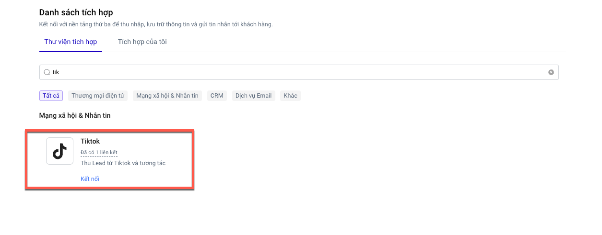

# Tích hợp Tiktok

### Tích hợp Tiktok

1. Tìm và chọn ứng dụng **Tiktok**.

<figure><figcaption></figcaption></figure>

2. Chọn **Thêm liên kết.**
3. Đăng nhập với tiktok bằng cách chọn Kết nối với tiktok và cấp quyền truy cập.

<figure><figcaption></figcaption></figure>

<figure><figcaption></figcaption></figure>

4.  Chọn tài khoản quảng cáo, điền tên tích hợp và chọn **Lưu liên kết**.\

    <figure><figcaption></figcaption></figure>

    **Hiện tại hệ thống không giới hạn số tích hợp Tiktok.**
