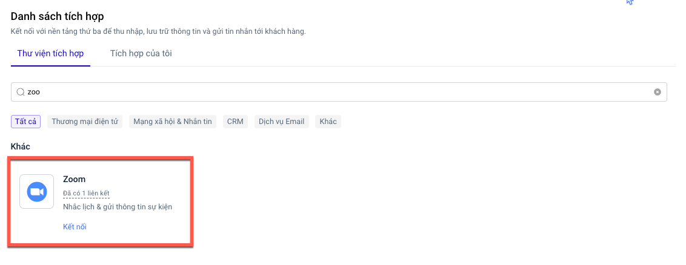

# Tích hợp Zoom

### Tạo ứng dụng trên Zoom

1. Truy cập vào đường dẫn [https://marketplace.zoom.us/](https://marketplace.zoom.us/)
2. Đăng nhập tài khoản zoom của bạn
3. Chọn **Develop**, sau đó chọn **Build App**

<figure><figcaption></figcaption></figure>

4. Chọn **Server to Server OAuth App** và chọn **Create**

<figure><figcaption></figcaption></figure>

5. **Nhập App Name** và chọn **Create.**

<figure><figcaption></figcaption></figure>

Được kết quả như sau:

<figure><figcaption></figcaption></figure>

6. **Điền thông tin tab Information.**

<figure><figcaption></figcaption></figure>

7. **Chuyển tab Scope và chọn Add scope.**

<figure><figcaption></figcaption></figure>

8. **Tích chọn đủ các scope sau**:

* View a meeting / meeting:read:meeting:admin

<figure><figcaption></figcaption></figure>

* View a user's meetings / meeting:read:list\_meetings:admin

<figure><figcaption></figcaption></figure>

* Create a meeting for a user / meeting:write:meeting:admin

<figure><figcaption></figcaption></figure>

* View a webinar / webinar:read:webinar:admin

<figure><figcaption></figcaption></figure>

* View a user's webinars / webinar:read:list\_webinars:admin

<figure><figcaption></figcaption></figure>

* Create a webinar for a user / webinar:write:webinar:admin

<figure><figcaption></figcaption></figure>

* View a user / user:read:user:admin

<figure><figcaption></figcaption></figure>

9. Chọn **Continue** để tiếp tục.

<figure><figcaption></figcaption></figure>

10. Chọn **Activate** your app.

<figure><figcaption></figcaption></figure>

Kết quả sẽ như sau:

<figure><figcaption></figcaption></figure>

### Tích hợp Zoom trên LadiFlow

1. Truy cập LadiFlow, mở mục **Tích hợp**, tìm và chọn ứng dụng **Zoom.**

<figure><figcaption></figcaption></figure>

2. Nhập Tên tích hợp.
3. Chọn **Thêm liên kết** và điền các thông tin vào Form như sau:

* Lấy thông tin Account ID, Client ID, Client Secret, Secret Token lấy trên tab App Credentials:

<figure><figcaption></figcaption></figure>

* Copy Secret Token từ tab Feature:

<figure><figcaption></figcaption></figure>

4. Chọn **Lưu liên kết** để hoàn thành thêm mới tích hợp.

### Thêm webhook vào ứng dụng trên Zoom

1. Mở mục **Feature**, sau đó chọn bật **Event Subscriptions.**\

<figure><figcaption></figcaption></figure>

2. Chọn **Add Event Subscription.**

<figure><figcaption></figcaption></figure>

3. Chọn **Add Events** và **tích chọn các mục** như hìn&#x68;**:**

<figure><figcaption></figcaption></figure>

* Meeting:&#x20;

<figure><figcaption></figcaption></figure>

* Webinar:

<figure><figcaption></figcaption></figure>

4. Chọn **Done.**
5. Trên LadiFlow chọn tích hợp của tôi, mở tích hợp Zoom bạn vừa tạo.
6. Chọn sao chép **Url Webhook.**

<figure><figcaption></figcaption></figure>

7. Dán Url Webhook vừa sao chép, dán vào mục **Event notification endpoint URL.** Sau đó chọn **Validate**.

<figure><figcaption></figcaption></figure>

8. Sau khi validate thành công, bạn **chọn Save** để lưu lại.

**Hiện tại hệ thống không giới hạn số tích hợp Zoom.**

\
